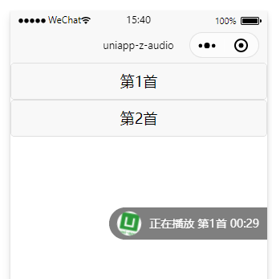
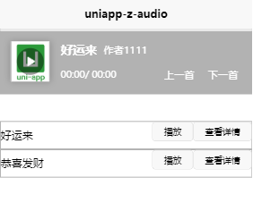
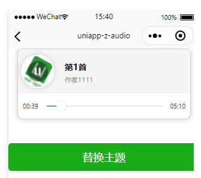

### uniapp 音频后台播放组件

---
### 特性
+ 支持H5, app, 微信小程序播放
+ 支持切换后台播放
+ 支持来电中断后续播
+ 支持全局多页面同步播放状态

### 预览





### 使用步骤 

0. 配置vuex属性和方法(必须) 
直接复制store/modules/zaudio即可

1. 引入挂载音频对象 
此时会创建zaudio全局组件, 和$audio音频播放对象 
```javascript
import store from './store'
Vue.prototype.$store = store;
import ZAudioCtx from 'components/audio/index.js'
Vue.use(ZAudioCtx, store)
```


2. 小程序或app中引入zaudio局部组件 
(h5已使用全局组件,无需此步)

```
import zaudio from '@/components/audio/zaudio.vue';
//...省略
export default {
	components:{zaudio},
}
```


3. 使用组件 (详见示例和参数配置) 
  - `<zaudio theme="theme3" :autoplay="false" :continue="true" ref="zaudio"></zaudio>`
  - 配置`mapMutations`和`mapGetters`

4. 设置音频列表: 
   此步必须在设置set_renderIndex之前
   ```
   this.set_audiolist(this.songlist);
   ```
 
5. 手动指定播放:  
   方法1: 指定索引
   ```
   this.set_renderIndex(key);   //渲染指定索引
   this.$refs.zaudio.operation(true);    // 播放或暂停音频, true为固定值, zaudio组件添加ref属性
   ```
   方法2:  指定播放信息
   ```
   this.set_audio(this.audiolist[key]);   //染播放信息
   this.$refs.zaudio.operation(true);    // 播放或暂停, true为固定值,  zaudio组件添加ref属性
   ```

6. 多个页面共享播放状态:  
   例如: 当前列表有A和B两首歌, 当前正在播放A, 跳转B这首歌的详情页,需要渲染B这首歌的信息,之后再返回,需要看到同步当前A歌曲的播放状态
   
   方法1: 指定索引
	```
	this.set_renderIndex(key);   //渲染指定索引
	uni.navigateTo({      //跳转页面后看到渲染信息已改变
		url: '/pages/detail/index'
	});
	```
   方法2:  指定播放信息
	```
	this.set_audio(this.audiolist[key]);   //染播放信息
	uni.navigateTo({      //跳转页面后看到渲染信息已改变
		url: '/pages/detail/index'
	});
	```
	
	之后返回页面需要同步当前播放信息,
	因为`renderIndex`会变动,所以需要在onShow中再次更新当前的播放索引(此步必须放onShow中)
   ```
   this.set_renderIndex(this.playIndex);
   ```
	


### 组件参数配置

参数 | 类型 | 必填 | 描述 | 其他
-|-|-|-|-
default_cover | String | false | 默认音频封面 | 默认`/static/logo.png`
theme | String | false | 皮肤 | `theme2` or `theme1` or `theme3`;   默认`theme1`
themeColor | String | false | 进度条颜色 |  默认 `#42b983`
stepShow | Boolean | false | 显示快进按钮 |  默认 `true`, 只作用于`theme1`
autoplay | Boolean | false | 自动播放 |  默认 `false` 
continue | Boolean | false | 下一首续播 |  默认 `true` 

### vuex配置 
store/modules/zuadio.js

+ state: 
  ```javascript
  state: {
	  renderIndex: 0, // 组件渲染的索引值
	  audiolist: [      //音频列表
		  {
		  	src: '',     //地址
		  	title: '',     //标题
		  	singer: '',      //作者
		  	coverImgUrl: ''     //封面
		  }
	  ],
	  audio: { 		 //zaudio组件-当前渲染的音频数据
		current: 0,  		//当前时间
		duration: 0, 		//总时间
		duration_value: 0,  //总长度
		current_value: 0,   //当前长度
		src: '',     		//当前音频地址
		title: '',	 		//当前音频标题
		singer: '',  		//当前音频作者
		coverImgUrl: '',    //当前音频封面
	  },
	  playinfo: {      //$audio对象-当前播放的音频数据
		current: 0,   		//当前时间
		duration: 0, 		//总时间
		duration_value: 0,  //总长度
		current_value: 0,   //当前长度
		src: "",			//当前音频地址	
		title: '',			//当前音频标题
		singer: '',			//当前音频作者
		coverImgUrl: ''		//当前音频封面
	  },
	  paused: true, //$audio对象当前播放音频的暂停状态
	  
	  n_pause: false, //$audio对象当前播放音频的意外中断的状态
  }
  ```

+ mutations: 
  - `set_renderIndex`: 设置`zaudio组件`渲染的索引值和渲染信息

  用法:  
  渲染列表索引为2的数据
  ```
  set_renderIndex(2)
  ```
  
  - `set_audiolist`: 设置音频列表数据
  
   用法:  
   @params status Boolean  true-> 记录之前的列表数据 false->不记录,仅仅赋值
   @params data   Array    列表数据
   ```
   set_audiolist({
	   data:[
			   {
				src: '',     //地址
				title: '',     //标题
				singer: '',      //作者
				coverImgUrl: ''     //封面
			   }
		   ],
		status: true      //记录之前赋值的数据
   })
   ```

  - `set_audio`: 设置`zaudio组件`当前渲染的音频信息, 若音频信息包含在`audiolist`中, 则会更新`renderIndex`

  用法:
  更新zaudio展示的数据
  ```
  set_audio({
	   	src: '',     //地址
	   	title: '',     //标题
	   	singer: '',      //作者
	   	coverImgUrl: ''     //封面
	   });
  ```

  - `set_playinfo`: 设置当前音频播放信息(具体开发时不需要用到)

  用法:
  更新当前正在播放的数据, 不会影响zaudio的展示
  ```
  set_playinfo({
		src: '',
		title: '',
		singer: '',
		coverImgUrl: '',
		duration: '',
		duration_value: ''
	});
  ```

  - `set_pause`: 设置当前音频暂停状态(具体开发时不需要用到)
  
  用法:
  更新为意外中断状态, 不会直接暂停音频,只是记录状态
  ```
  set_pause(true);
  ```
  
  - `set_n_pause`: 设置当前音频意外中断状态(具体开发时不需要用到)
  
  用法:
  更新为播放状态, 不会直接暂停音频,只是记录状态
  ```
  set_n_pause(false);
  ```
  
+ getters:
  - audiolist: 返回音频列表数据
  - playinfo: 返回当前`正在播放`的数据
  - playIndex: 返回当前`正在播放`的数据索引值
  - n_pause: 返回意外中断状态
  -	paused: 返回音频暂停状态
  - renderIndex: 返回`zaudio组件`渲染的索引值
  - audio: 返回`zaudio组件`当前渲染的音频信息
  - renderIsPlay: 返回判断渲染与播放是否是同一首音频


### 切换后台播放配置

在manifest.json中配置
小程序

```
 "mp-weixin" : {
		"requiredBackgroundModes" : [ "audio" ],
        "appid" : "",
        "setting" : {
            "urlCheck" : false
        },
        "usingComponents" : true
    }
```
注意ios端需要打包ipa才生效
iOS

```
"ios" : {
    "UIBackgroundModes" : [ "audio" ]
}
```

### 更新日志

v0.0.55
- set_audiolist方法加入status参数,区分是否记录列表数据

v0.0.54
- 修复H5端切换歌曲报错问题

v0.0.53
- 修复android端切换歌曲报错问题

v0.0.52
- 增加getters:`renderIsPlay`
- 修复快进失效, 进度条拖动错误问题

v0.0.51
- 拆分store, 调整使用步骤

v0.0.5
- 修复多次创建监听$audio事件的问题
- 拆分渲染组件与播放音频的索引值
- 播放状态移入vuex中管理
- 增加`手动指定播放`与`多页面共享播放状态`的示例

v0.0.43
- 修复进度条不同步的bug
- 替换音频链接


v0.0.42
- 增加theme3主题

v0.0.41
- 支持下一首续播

v0.0.4
- 增加自动播放
- `theme1`主题修改
- 增加音频切换
- 主题参数变更为`theme1`和`theme2`
- 完善使用文档

v0.0.32
- 增加音频列表更新, 切换主题的示例

v0.0.3
- 增加主题选择,  自定义主题色, 隐藏快进按钮

v0.0.1
- 支持 h5, app, 微信小程序播放
- 支持小程序, app 后台播放
- 支持来电中断后续播(app 端)

### 如果你觉得这个项目不错, 欢迎[STAR!](https://github.com/P3T3R-Z/uniapp-z-audio.git)