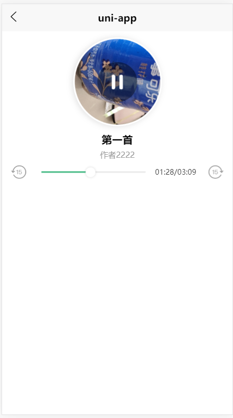
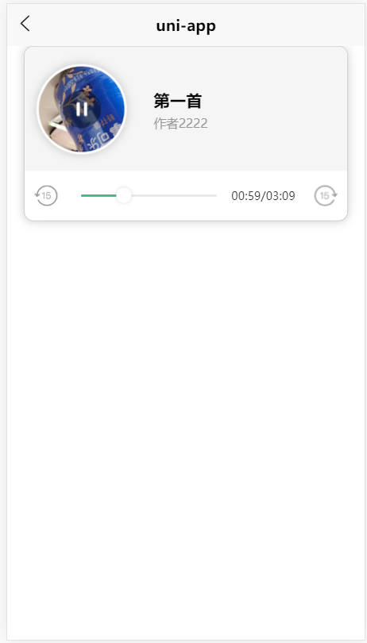

### uniapp 全局音频播放组件

---
#### 预览



#### 更新日志
v0.0.3

- 增加皮肤选择,  自定义主题色, 隐藏快进按钮

v0.0.1
- 支持 h5, app, 微信小程序播放
- 支持小程序, app 后台播放
- 支持来电中断后续播(app 端)

#### 后台播放配置

小程序

```
 "mp-weixin" : {
		"requiredBackgroundModes" : [ "audio" ],
        "appid" : "",
        "setting" : {
            "urlCheck" : false
        },
        "usingComponents" : true
    }
```

iOS

```
"ios" : {
    "UIBackgroundModes" : [ "audio" ]
}
```
#### 参数

参数 | 类型 | require | 描述 | 其他
-|-|-|-|-
info | Object | true | 音频对象 | info对象: `src` (音频地址), `title` (标题), `singer`(作者), `coverImgUrl`(海报)
theme | String | false | 皮肤 | 枚举值 `fm` or `music`;  默认`fm`
themeColor | String | false | 进度条颜色 | 默认 `#42b983`
stepShow | Boolean | false | 显示快进按钮 | 默认 `true`

